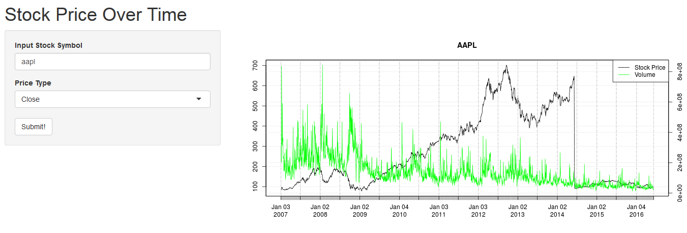

## Application Summary


- The stock price application allows users simple way to select any listed US stock and return the price and volume.

- By comparing price and volume, the users can see trends and patterns over time.


---


## User Interface



---

## Future Plans

In the future, additional features will be added to the application such as:

1. Correlation between stock price and other key metrics
2. Premium features for paid user accounts
3. Stock analysis and recommendations

---

## Start Using Today!

Use the app today and stand by for new developments!


```{r simple-plot, fig.height = 6, fig.align = 'center', message = F, echo=F}
require(quantmod)
dat <- getSymbols("AAPL", auto.assign=FALSE)
plot(dat[,4], main="AAPL")
									par(new=t)
									plot(dat[,5], main=NA, col="green", axes=FALSE)
									axis(side=4)
									legend("topright",
											legend=c("Stock Price", "Volume"),
											lty=c(1,1), col=c("black", "green"))
							
```

---
