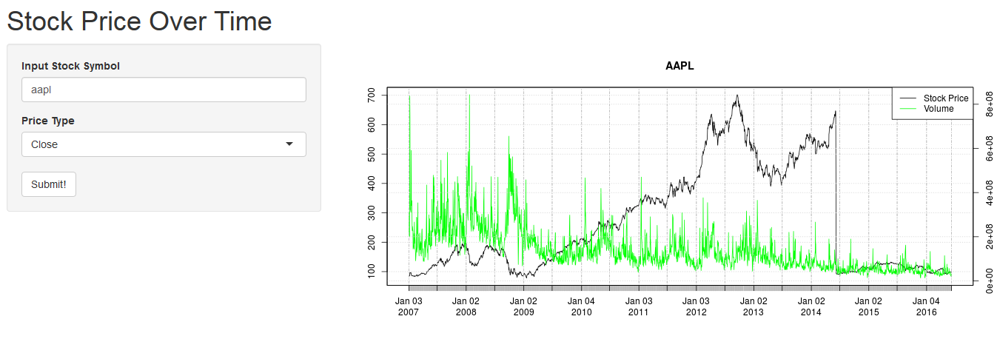
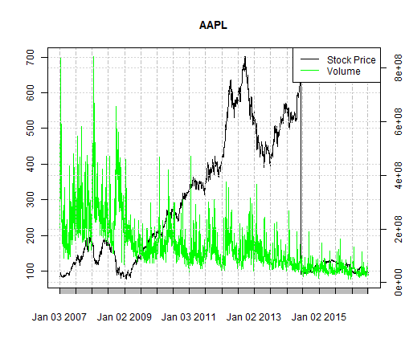

## Application Summary

- The stock price application allows users simple way to select any listed US stock and return the price and volume.

- By comparing price and volume, the users can see trends and patterns over time.

---

## User Interface

---

## Future Plans

In the future, additional features will be added to the application such as:

1. Correlation between stock price and other key metrics
2. Premium features for paid user accounts
3. Stock analysis and recommendations

---

## Start Using Today!

Use the app today and stand by for new developments!

---
